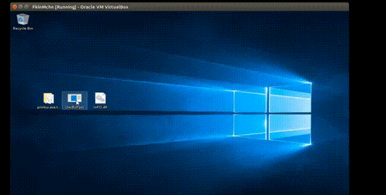

# Some Notes:
printui.exe takes input param that means that there is a chance for a fileless/registry manipulation based bypass, i didnt check that becouse loss of interest...

# yet another uac by pass
why do i write 'yet another'?? well becouse thats the best way i can describe this & becouse IoFileOperation was abused so many times so its not anything new or interesting. i was researching the way consent exe gets loaded under standard user cred, and was looking for an auto-elevated feature to do that. i came across printui.exe. 
while looking at process monitor i noiteced that when operating printui.exe from sysWow64 it looks for printui.exe.local (supports side by side asseambly redirection...), and from there on the story is very short.
# How?
becouse printui.exe is auto-elevated, then every dll that will be injected into it will run as a high integrity process. becouse it supports side by side redirection then we can make he'm load our dll. in order to invoke the side by side redirection we need to make a new directory under SysWow64 named printui.exe.local with the needed asseambly information (you can download my directory from the bin directory it simplly defines the common-controls components that fits to the printui manifest). how can we write to SysWow64??
invoke IoFileOperation interface that is auto-elevated (via-explorer.exe) "As Windows only cares about loader entry information as they use PSAPI like bullshit" (Quote hfiref0x), meaning that if the IoFileOperation will come from a trusted source (the explorer.exe) then the operation will be successful. you can do that by Masquerade the process PEB, but i was too lazy to do that and decided just to inject a dll that will perform the operation in the context of the explorer.exe.

# answers before you'll ask!
i have no intention to compile the binarys for you, neither to supply legacy support, i will not answer any issues here regardnig this uac by pass work your head a little compile it yourself make improvments or wtv, it is just not that interesting for me to really support this project, this is only a simple POC.
# compiling:
see that your dll's are 64 bit, same for the dll loader, make a directory named printui.exe.local with another directory inside with the common control (adjust the ver to the current installation your running....) compile the fake ComCtl32.dll that i have provided and place inside the inner directory (same as the bin folder..) compile your payload dll that i have provided and inject it to explorer exe with the loader provided, the loader will run printui.exe after invoking the IoFile operation.
and then install linux & enjoy!

# More info on this method:
<html><a href="http://www.kernelmode.info/forum/viewtopic.php?f=11&t=3643&start=110">KernelMode.info</a><html>
  
# Proof Of Concept

# Tested on:
win 10 build 15063.143 with the default uac settings.  
date: 29/8/17.
